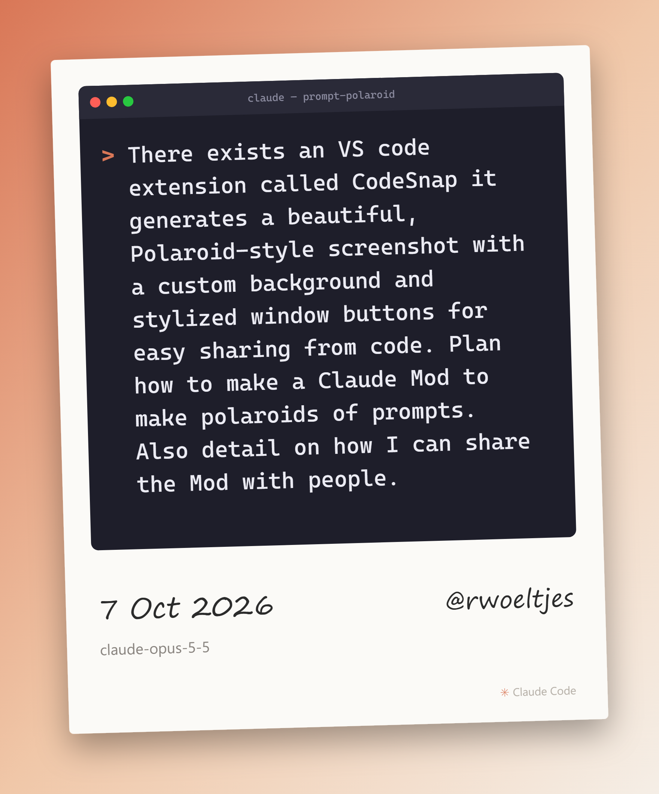

# Prompt Polaroid 📸

CodeSnap-style Polaroid snapshots of your Claude Code prompts, ready to share.



## Use

| Command | What it snaps |
| --- | --- |
| `/polaroid` | your last prompt |
| `/polaroid 3` | your 3rd-last prompt |
| `/polaroid "any text"` | whatever you type |

A **Prompt Polaroid** pane opens with a preview (desktop / VS Code show it live; the
terminal shows it after saving). Buttons (with hotkeys while the pane has focus):

- **◀ / ▶** (`p` / `n`): change the background (Claude Clay, Sunset, Ocean, Forest, Mono, Transparent)
- **Save** (`s`): writes `polaroid_<date>.png` (2x, via headless Edge/Chrome) and `.svg`
- **Copy image** (`c`): puts the PNG on your clipboard, so you can paste it straight into Slack/X/LinkedIn
- **Open folder** (`o`)

## Settings

In the config menu (or `pluginConfigs["prompt-polaroid"].options` in `settings.json`):

| Option | Default |
| --- | --- |
| `theme` | `clay` |
| `outputDir` | `~/Pictures/Claude Polaroids` |
| `handle` | *(empty)*: e.g. `@you`, written on the caption |
| `showModel` | `true` |
| `tilt` | `true` |
| `redactSecrets` | `true`: masks API keys, tokens, `password=…` values and e-mail addresses |

## Requirements

- Claude Code with function-hook plugins (mods).
- PNG export needs Microsoft Edge (built into Windows), Google Chrome or Chromium. Without one you still get the SVG.
- Copy image: Windows (PowerShell), macOS (`osascript`), Linux (`xclip`).

## Develop

```bash
claude plugin validate .
claude plugin test .
```
